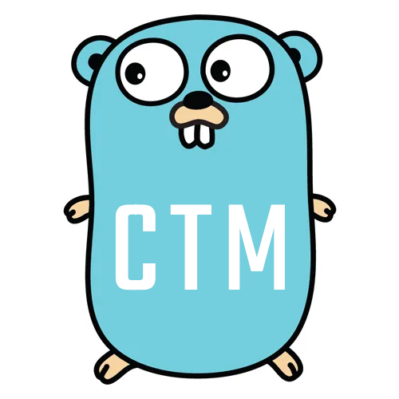

This repository is work in progress open-sourcing libraries I've created during 
my time as a Go developer.

[](https://goreportcard.com/report/github.com/ctx42/testing)
[](https://pkg.go.dev/github.com/ctx42/testing)


I’ve written several [blog posts](http://blog.ctx42.com/tags/gtm/) tied to this
repository. If you’re curious about the behind-the-scenes details of how this
package is coming together, check them out and share your thoughts—I’d love to
hear what you think! Any feedback is greatly appreciated.

---

<!-- TOC -->
* [Introduction to Ctx42 Testing Module](#introduction-to-ctx42-testing-module)
  * [Simplicity and Usability](#simplicity-and-usability)
  * [Modular and Extensible Design](#modular-and-extensible-design)
  * [Installation](#installation)
  * [Packages](#packages)
    * [Main Packages](#main-packages)
    * [Supporting Packets](#supporting-packets)
<!-- TOC -->

# Introduction to Ctx42 Testing Module

This repository marks the beginning of CTX42 Testing Module, a collection of 
testing and assertion packages poised to help developers approach testing. As 
it develops, it will offer a comprehensive suite of tools designed to make 
testing more efficient, enjoyable, and integral to the development process.

Whether you're a seasoned tester or just starting out, tools in this module is 
being crafted to meet your needs, providing a solid foundation for ensuring 
code reliability in projects of all sizes.

## Simplicity and Usability

At the heart of the module lies a commitment to minimalism and an exceptional
developer experience (DX). By maintaining zero external dependencies, the
framework stays lightweight and fast, free from the potential complexities and
conflicts that third-party modules can introduce. Our documentation is being
carefully designed to be thorough, clear, and packed with practical examples,
empowering you to master the module with ease. Expect a great DX with features 
like a fluent, chainable API, descriptive error messages for quick debugging, 
all tailored to streamline your testing workflow.

## Modular and Extensible Design

The `testing` module is built as a collection of modular, laser-focused
packages, each targeting a specific aspect of testing. For instance, you might
leverage the `assert` package for assertions, the `mock` and `mocker` packages
for test doubles, or the `tstkit` package to keep your tests readable and
minimalistic. The modularity lets you customize your testing setup to fit your
project’s exact needs, avoiding unnecessary overhead. Beyond customization, the 
extensible architecture invites you to create your own test helpers ensuring.

## Installation
To install CTX42 Testing Module, use go get:

```shell
go get github.com/ctx42/testing
```

This will make all the package modules available to you.

## Packages

### Main Packages

Packages used in test cases. 

- Package [assert](pkg/assert/README.md) provides assertion toolkit.
- Package [check](pkg/check/README.md) provides equality toolkit used by `assert` package.
- Package [goldy](pkg/goldy/README.md) provides basic golden file support.
- Package [mock](pkg/mock/README.md) provides primitives for writing interface mocks.
- Package [mocker](pkg/mocker/README.md) provides an interface mock generator.
- Package [must](pkg/must/README.md) provide basic test helpers which panic on error.
- Package [tstkit](pkg/tstkit/README.md) provides all sorts of test helpers that are not assertions.

### Supporting Packets

Packages are used to create custom checks, assertions, and helpers.

- Package [dump](pkg/dump/README.md) provides a configurable renderer of any type to a string.
- Package [notice](pkg/notice/README.md) helps to create nicely formated assertion messages.
- Package [tester](pkg/tester/README.md) provides facilities to test `Test Helpers`.

Click on the package link to see its README.md file with documentation. Also, 
most of the packages contain `examples_test.go` file with usage examples.
